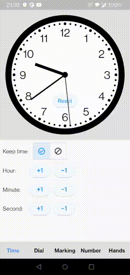
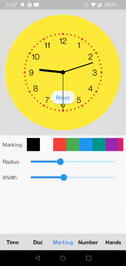
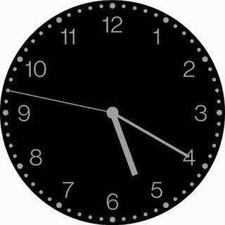
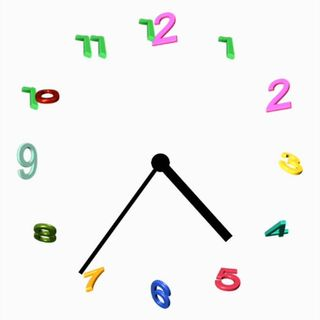
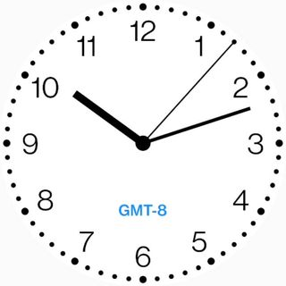

# Flutter Analog Clock

[](https://pub.dev/packages/flutter_analog_clock)

A simple, highly customizable analog clock widget.
This widget enables you to customize the clock's background, dial, markings, and hands.

        

## Install

In the `pubspec.yaml` of your flutter project, add the following dependency:
```yaml
dependencies:
  flutter_analog_clock: ^1.0.3
```
In your library add the following import:
```dart
import 'package:flutter_analog_clock/flutter_analog_clock.dart';
```

## Usage

### 1. Simple to use

```dart
  const AnalogClock()
```
```dart
  const AnalogClock.dark()
```

### 2. Use an image as a clock face

```dart
  Container(
    decoration: const BoxDecoration(
      image: DecorationImage(image: AssetImage('assets/dial01.webp')),
    ),
    child: const AnalogClock(
      dialColor: null,
      markingColor: null,
      hourNumberColor: null,
      secondHandColor: null,
    ),
  ),
```

### 3. With a child

```dart
  AnalogClock(
    dateTime: DateTime(2022, 10, 24, 10, 12, 07),
    isKeepTime: false,
    child: const Align(
      alignment: FractionalOffset(0.5, 0.75),
      child: Text('GMT-8'),
    ),
  ),
```

### 4. Customize to use
```dart
  AnalogClock(
    dateTime: DateTime.now(),
    isKeepTime: true,
    dialColor: Colors.white,
    dialBorderColor: Colors.black,
    dialBorderWidthFactor: 0.02,
    markingColor: Colors.black,
    markingRadiusFactor: 1.0,
    markingWidthFactor: 1.0,
    hourNumberColor: Colors.black,
    hourNumbers: const ['', '', '3', '', '', '6', '', '', '9', '', '', '12'],
    hourNumberSizeFactor: 1.0,
    hourNumberRadiusFactor: 1.0,
    hourHandColor: Colors.black,
    hourHandWidthFactor: 1.0,
    hourHandLengthFactor: 1.0,
    minuteHandColor: Colors.black,
    minuteHandWidthFactor: 1.0,
    minuteHandLengthFactor: 1.0,
    secondHandColor: Colors.black,
    secondHandWidthFactor: 1.0,
    secondHandLengthFactor: 1.0,
    centerPointColor: Colors.black,
    centerPointWidthFactor: 1.0,
  )
```

### 5. Specify a time
```dart
class ExampleSpecifyTime extends StatefulWidget {
  const ExampleSpecifyTime({Key? key}) : super(key: key);

  @override
  State<ExampleSpecifyTime> createState() => _ExampleSpecifyTimeState();
}

class _ExampleSpecifyTimeState extends State<ExampleSpecifyTime> {
  final GlobalKey<AnalogClockState> _analogClockKey = GlobalKey();
  @override
  Widget build(BuildContext context) {
    return Scaffold(
      appBar: AppBar(
        title: const Text('Analog clock'),
      ),
      body: AnalogClock(
        key: _analogClockKey,
        dateTime: DateTime(2022, 10, 24, 1, 23, 45),
        isKeepTime: false,
      ),
      persistentFooterButtons: [
        ElevatedButton(
          onPressed: () {
            _analogClockKey.currentState!.dateTime = DateTime.now();
          },
          child: const Text('Now'),
        ),
        ElevatedButton(
          onPressed: () {
            _analogClockKey.currentState!.isKeepTime = true;
          },
          child: const Text('Keep time'),
        ),
      ],
    );
  }
}
```

You can find all custom options here:
> https://github.com/conghaonet/flutter_analog_clock/blob/master/example/lib/example.dart