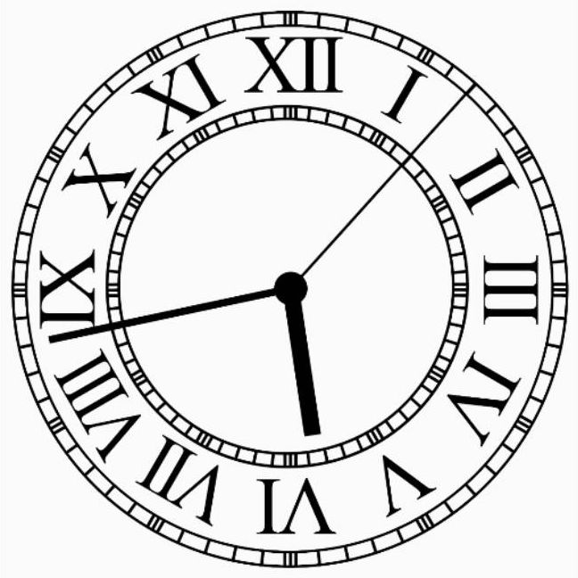

# Flutter Analog Clock

[](https://pub.dev/packages/flutter_analog_clock)

A simple, highly customizable analog clock widget.


##Install


In the `pubspec.yaml` of your flutter project, add the following dependency:
```yaml
dependencies:
  flutter_analog_clock: ^1.0.1
```

In your library add the following import:

```dart
import 'package:flutter_analog_clock/flutter_analog_clock.dart';
```
## Usage

### 1. Simple to use
```dart
  const AnalogClock()
```
or
```dart
  const AnalogClock.dark()
```


### 2. Customize to use
```dart
  AnalogClock(
    dateTime: DateTime.now(),
    isKeepTime: true,
    dialColor: Colors.white,
    dialBorderColor: Colors.black,
    dialBorderWidthFactor: 0.02,
    markingColor: Colors.black,
    markingRadiusFactor: 1.0,
    markingWidthFactor: 1.0,
    hourNumberColor: Colors.black,
    hourNumbers: const ['', '', '3', '', '', '6', '', '', '9', '', '', '12'],
    hourNumberSizeFactor: 1.0,
    hourNumberRadiusFactor: 1.0,
    hourHandColor: Colors.black,
    hourHandWidthFactor: 1.0,
    hourHandLengthFactor: 1.0,
    minuteHandColor: Colors.black,
    minuteHandWidthFactor: 1.0,
    minuteHandLengthFactor: 1.0,
    secondHandColor: Colors.black,
    secondHandWidthFactor: 1.0,
    secondHandLengthFactor: 1.0,
    centerPointColor: Colors.black,
    centerPointWidthFactor: 1.0,
  )
```

### 3. Specify a time
```dart
class ExampleSpecifyTime extends StatefulWidget {
  const ExampleSpecifyTime({Key? key}) : super(key: key);

  @override
  State<ExampleSpecifyTime> createState() => _ExampleSpecifyTimeState();
}

class _ExampleSpecifyTimeState extends State<ExampleSpecifyTime> {
  final GlobalKey<AnalogClockState> _analogClockKey = GlobalKey();
  @override
  Widget build(BuildContext context) {
    return Scaffold(
      appBar: AppBar(
        title: const Text(''),
      ),
      body: AnalogClock(
        key: _analogClockKey,
        dateTime: DateTime(2022, 10, 24, 8, 23, 45),
        isKeepTime: false,
      ),
      persistentFooterButtons: [
        ElevatedButton(
          onPressed: () {
            _analogClockKey.currentState!.dateTime = DateTime.now();
          },
          child: const Text('Now'),
        ),
        ElevatedButton(
          onPressed: () {
            _analogClockKey.currentState!.isKeepTime = true;
          },
          child: const Text('Keep time'),
        ),
      ],
    );
  }
}
```

### 4. Use an image as a clock face

```dart
  Container(
    decoration: const BoxDecoration(
      image: DecorationImage(image: AssetImage('assets/dial01.webp')),
    ),
    child: const AnalogClock(
      dialColor: null,
      markingColor: null,
      hourNumberColor: null,
      secondHandColor: null,
    ),
  ),
```